# 🌟 Riding the Ethical Beauty Wave with Google Trends! 🌟

Hello, beauty enthusiasts, data geeks, and curious minds! 💅📊

Welcome to an exciting journey where **ethics meets analytics**. In this project, we dive deep into **Google Trends** to uncover what’s hot in the world of **cruelty-free** and **vegan beauty**. Are people shifting towards ethical choices? What’s driving the buzz? Let’s find out! 

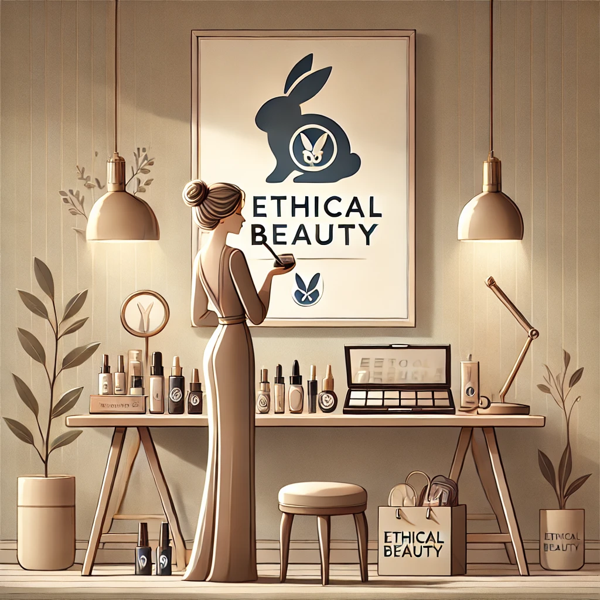
---

## 🌿 The Problem:
As consumers increasingly prioritize ethical and sustainable practices, the beauty industry has seen a surge in demand for **cruelty-free** and **vegan** products. However, understanding and predicting these trends remains a challenge for brands, policymakers, and ethical advocates. Businesses need actionable insights into **consumer interest** over time to effectively adapt marketing strategies, align with consumer values, and forecast future trends.

Key Questions:
1. **How has interest in cruelty-free and vegan beauty evolved over time?**
2. **What events or campaigns (e.g., “Save Ralph”) influence consumer behavior?**
3. **Can we predict future interest in cruelty-free cosmetics and related topics?**

---


## 🔧 The Solution:
We employ **time-series analysis** and **machine learning models** to uncover patterns and make accurate predictions. This approach provides actionable insights for brands and stakeholders to:
- Identify **peak interest periods** for marketing campaigns.
- Understand the **impact of ethical campaigns** like "Save Ralph."
- Forecast future trends to guide **product development** and **investment decisions**.

The final solution is a **predictive model** that uses historical Google Trends data to:
- Analyze **current interest trends.**
- Predict **future interest** in cruelty-free cosmetics.

---


## 🗺️ Roadmap to Glamorous Insights

This project provides a **data-driven roadmap** for navigating the future of ethical beauty, combining **business insights** with a commitment to sustainability and consumer values. 🐰💄✨

Here’s the game plan for today’s adventure:
1. **[Data Collection](#1-data-collection)** – Gathering Google Trends data for popular beauty keywords.
2. **[Data Prep & Cleanup](#2-data-cleaning-and-preparation)** – Scrubbing the data to make it shine.
3. **[Exploratory Data Analysis](#3-exploratory-data-analysis-eda)** – What secrets are hiding in the trends? 
4. **[Feature Engineering](#4-feature-engineering-and-selection)** – Turning raw data into supercharged features.
5. **[Model Showdown](#5-model-building-and-evaluation)** – Testing machine learning models in a fierce beauty battle. 💪
6. **[Model Deployment](#6-deployment)** – model deployment of the trained machine learning model using **Flask** and **Docker** for containerization.
7. **[Conclusion and Recommendations](#6-conclusion-and-recommendations)** – What did we learn? What’s next? 
8. **[Watch the Save Ralph Campaign](#️-watch-the-save-ralph-campaign)** – Ethical beauty isn’t just a trend—it’s a movement. 

---

## 1. 🕵️‍♀️ Data Collection
### Goal: Collect Interest Over Time data from Google Trends for the selected keywords.

We collected data from Google Trends for several beauty-related keywords to analyze the trends in **Cruelty-Free Cosmetics** and related topics.

**Primary Keywords** :
- "cruelty free cosmetics"
- "cruelty free makeup"
- "cruelty free skincare"
- "vegan cosmetics"

**Secondary Keywords** (for comparison):
- "cosmetics"
- "vegan"

**Specific Brands** (optional but interesting):
- "The Body Shop"
- "Lush"
- "E.L.F. cosmetics"

Navigate to [Google Trends](https://trends.google.com/trends/explore)
&
Set parameters like:
  - **Time Frame**: Last 5 years (or a period providing sufficient data).
  - **Geographical Location**: Worldwide or a specific region.
  - **Category**: All categories or Beauty & Fitness.
  - **Search Type**: Web Search.

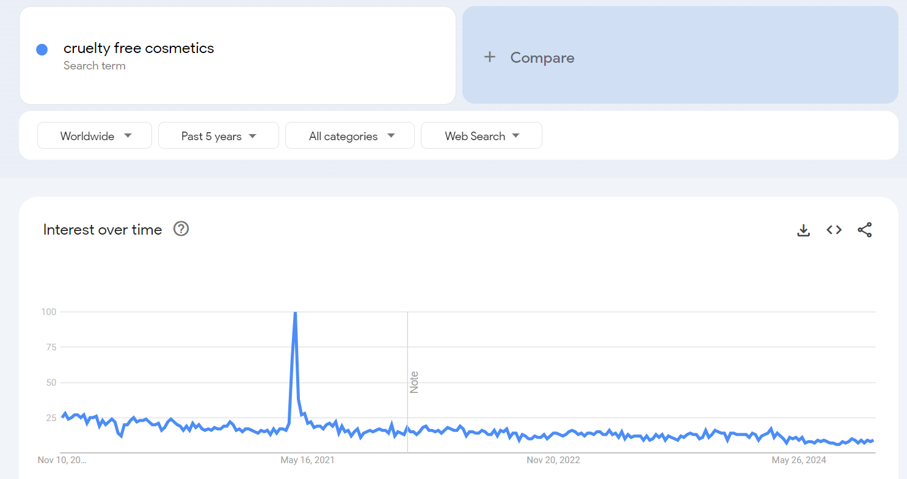

Once downloaded, the data is saved in CSV files, such as `cruelty_free_cosmetics.csv`, and stored in an organized folder.

---

## 2. 🧽 Data Cleaning and Preparation
### Goal: Clean and organize the collected data for analysis.

Before diving into analysis, we need to clean and prepare the data:
1. **Rename Columns**: Ensure all columns are consistently named (e.g., 'Date', 'Cruelty_Free_Cosmetics').
2. **Convert Dates**: Convert the 'Date' column to datetime format for proper sorting and analysis.
3. **Merge Data**: Combine the data from multiple CSV files into one Data Frame
4. **Handle Missing Data**: Remove any rows with missing data to avoid inconsistencies.


This preparation ensures that the data is ready for analysis and helps avoid potential issues in later steps.

## 3. 🔍 Exploratory Data Analysis (EDA)
### Goal: Explore your data to understand patterns, relationships, and insights that will inform your modeling choices.
### 3.1 Overview of the Data 📊

### Dataset Summary
- **Timeframe:** November 10, 2019 – November 10, 2024
- **Data Points:** 262 weeks
- **Keywords Tracked:** 7 beauty-related keywords including **Cruelty-Free** and **Vegan Cosmetics**

merged_data can be downloaded single [csv file](/cruelty_free_data/merged_data.csv)
### Key Stats
| **Keyword**               | **Mean Popularity** | **Max Popularity** | **Min Popularity** |
|---------------------------|---------------------|--------------------|--------------------|
| Cruelty-Free Cosmetics    | 15.71               | 100                | 6                  |
| Vegan Cosmetics           | 32                  | 100                | 15                 |
| Cosmetics                 | 63.28               | 100                | 49                 |

### Missing Data Check
- No missing values ✅

### 3.2 Trends Over Time 📈

### Highlights:
1. **Cruelty-Free Cosmetics**: Significant spike in **April 2021**, coinciding with the release of the **"Save Ralph" campaign**.
2. **Cosmetics & Vegan**: High and stable interest, maintaining a foundational role in the beauty industry.
3. **The Body Shop**: Peaks around the holiday season each year, aligning with promotional efforts.
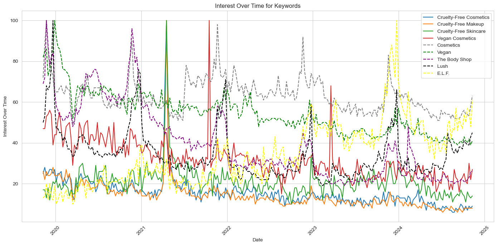

### Seasonal Observations
- **Holiday Spikes**: Every year, November–December sees sharp increases (holiday shopping!).
- **Sustainability Waves**: Renewed interest around Earth Day and related events.

## 3.3 Correlation Insights 🔗
### Goal: Understanding how the variables are related can inform feature selection and model design.

We performed **correlation analysis** to examine the relationships between features. A correlation matrix helps us understand how each feature is related to others, ranging from **-1** to **+1**:

- **+1:** Perfect positive correlation
- **-1:** Perfect negative correlation
- **0:** No correlation

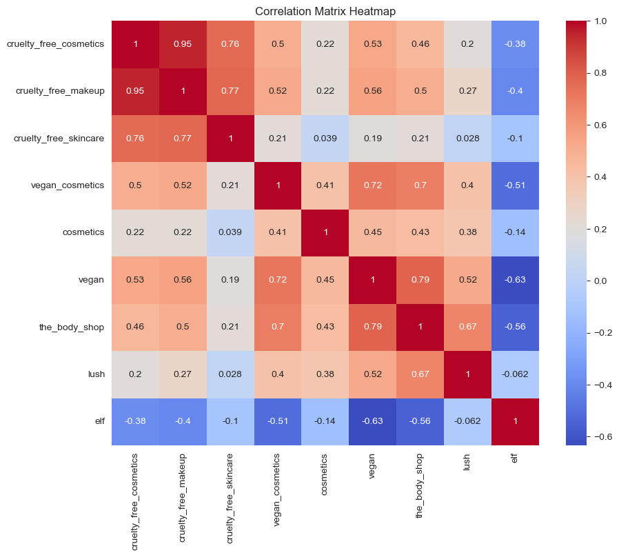

#### 1. **Cruelty-Free Cosmetics ↔ Cruelty-Free Makeup: Best Buddies! 🐰💄**
- **Correlation:** 0.95 (Strong Positive)
- **Insight:** These two features are nearly perfectly correlated, indicating that as the popularity of cruelty-free cosmetics increases, so does the demand for cruelty-free makeup.
- **Action:** Leverage this strong connection by bundling these products in marketing campaigns for maximum impact and appeal. 📈✨

#### 2. **Vegan ↔ The Body Shop (0.79):**
- **Correlation:** 0.79 (Strong Positive)
- **Insight:** There is a strong alignment between vegan interests and The Body Shop’s brand, which focuses heavily on ethical, vegan-friendly products.
- **Action:** Highlight this synergy in marketing materials to attract consumers who prioritize vegan products, reinforcing The Body Shop’s ethical commitment. 🌱💚

#### 3. **Vegan Cosmetics ↔ Cruelty-Free: Ethical Trends 🌿**
- **Correlation:** 0.48 (Moderate Positive)
- **Insight:** While there is some overlap between the audiences for vegan and cruelty-free products, they aren't always directly correlated. Consumers may prioritize one over the other depending on their values.
- **Action:** In marketing, emphasize the shared ethical values of both categories, but be sure to clearly distinguish between vegan and cruelty-free to appeal to a broader audience. 🔄🌍

#### 4. **E.L.F. ↔ Cruelty-Free Cosmetics**
- **Correlation:** -0.36 (Negative)
- **Insight:** The negative correlation suggests that E.L.F. attracts a different audience, focusing more on affordability than the ethical priorities of cruelty-free cosmetics consumers.
- **Action:** Position cruelty-free cosmetics as distinct from affordable brands like E.L.F. by focusing on their ethical values, sustainability, and quality. 💸❌

#### 5. **E.L.F. ↔ Vegan (-0.63)**
- **Correlation:** -0.63 (Negative)
- **Insight:** This negative correlation further indicates that E.L.F. primarily targets consumers seeking budget-friendly options, rather than those who prioritize strict ethical standards like veganism.
- **Action:** Differentiate vegan-focused products from E.L.F. by emphasizing the ethical and environmental benefits, appealing to a more ethically-conscious audience. 🦊🌿


---
### 3.4 Popularity Distributions 📦
- **Right-Skewed (Spiky):** Keywords such as Cruelty-Free Cosmetics, Cruelty-Free Makeup, Cruelty-Free Skincare, and Vegan Cosmetics exhibit a pattern of moderate, consistent interest with occasional dramatic spikes. These spikes suggest periodic surges in interest, often linked to specific events or trends in the market.

- **Left-Skewed (Steady):** In contrast, keywords like Cosmetics and Vegan demonstrate a more stable pattern, with consistent high levels of interest over time and fewer noticeable fluctuations. This suggests that these topics enjoy sustained, steady attention, likely due to their broad and ongoing relevance in the market.

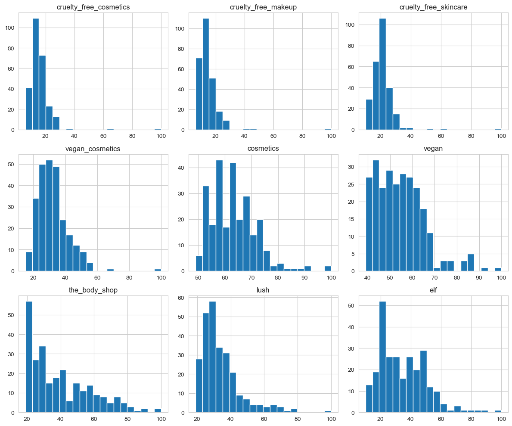

---


### 3.5 Seasonal Decomposition ❄️☀️
Since the data is time series, we can check for seasonality and trends.
### Components
- **Trend:** Cruelty-Free keywords show a steady trajectory, reflecting growing interest.
- **Seasonal:** Peaks during holiday months and sustainability-related events.
- **Residuals:** Captures major outliers like **April 2021**.

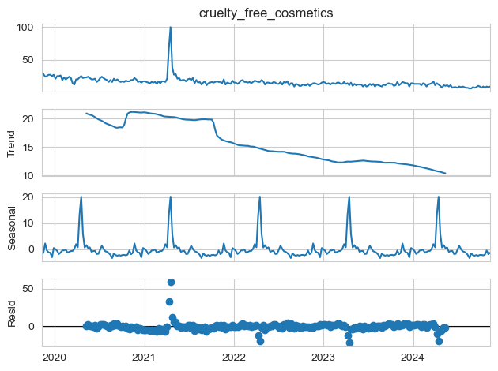
### 3.6 **The Star Event: "Save Ralph" 🐇**
- **Date:** April 6, 2021  
- **Impact:** A historic spike in cruelty-free interest, taking it from **17 to 100** overnight.  
- **Why It Matters:** Campaigns like this can shift public sentiment and spark trends.

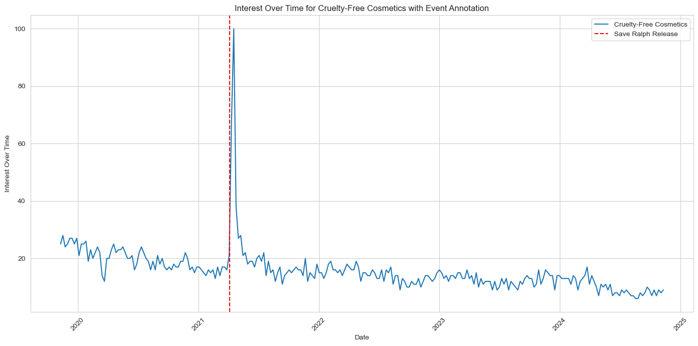

---

## 4. 🔧 Feature Engineering and Selection

### **Goal:** Improve model performance by creating meaningful features and selecting the most relevant ones.

### 4.1. **Log Transformation for Better Model Performance** 🔄

In time series and other machine learning models, **skewed data** with extreme peaks and valleys can have a negative impact on the model’s ability to make accurate predictions. The **Cruelty-Free Cosmetics** data, in its original form, exhibited such skewness, which could have made it harder for the model to effectively learn from the data. To address this, we applied a **log transformation** to the data.

### **Why Log Transformation?**
Log transformation helps to **normalize skewed data**, making it more symmetric and easier for the model to interpret. By reducing the influence of extreme outliers, the transformation helps the model focus on the overall trend rather than being disproportionately affected by rare, extreme values.

This transformation is especially useful when the data spans several orders of magnitude, which was the case with the **Cruelty-Free Cosmetics** data.

- **Before Transformation**: The original values were highly skewed, with large differences between values like 6, 15, and 100.
- **After Log Transformation**: By applying the log transformation, the data values become more evenly distributed. For example, a value of `100` becomes `4.61`, which is much closer to the range of the smaller values.
### **Cruelty-Free Cosmetics**

| **Before Log Transformation** | **After Log Transformation** |
|------------------------------|-----------------------------|
| 6                            | 1.79                        |
| 15                           | 2.71                        |
| 100                          | 4.61                        |


### **Impact on the Model:**
By applying the log transformation:
- We reduced the influence of **outliers** and extreme values, allowing the model to focus on the overall trends.
- The data became **more normally distributed**, improving model performance, stability, and convergence during training.
  
Overall, log transformation helps the model learn more robust patterns, especially in datasets with extreme values or wide-ranging data.
### 4.2. Create Time-Based Features

Time-based features such as **lag features** and **rolling averages** are particularly useful for capturing temporal patterns:

- **Lag Features**: Represent past values to help model momentum and trends over time. For example, in your project, lag features like `CFC_Lag1`, `CFC_Lag2`, and `CFC_Lag3` capture the previous, second-to-last, and third-to-last time periods. These features allow the model to understand how past behavior impacts the current value.

- **Rolling Averages**: Smooth out short-term fluctuations, making it easier for the model to learn long-term trends. In your case, rolling averages like `CFC_RollingMean_3` and `CFC_RollingMean_6` help the model capture the general trend over 3 or 6 periods, reducing the effect of short-term volatility.

### Why These Features Improve Predictive Power:
These features help the model account for both short-term changes and long-term trends, improving its predictive power:

- **Lag Features** allow the model to make use of past behavior, which helps in understanding momentum and identifying recurring trends.
- **Rolling Averages** allow the model to identify **long-term patterns** by reducing noise and emphasizing the broader trend.

By including both types of features, the model can make more accurate predictions by learning not just from the most recent data, but also from the **historical context** and **underlying trends** over time.


### 4.3 Feature Importance Explanation

The following histogram shows the **feature importance** scores for each feature used in the Random Forest model. These scores indicate how much each feature contributes to the model’s predictions. A higher score means the feature is more important in influencing the model’s decision-making.
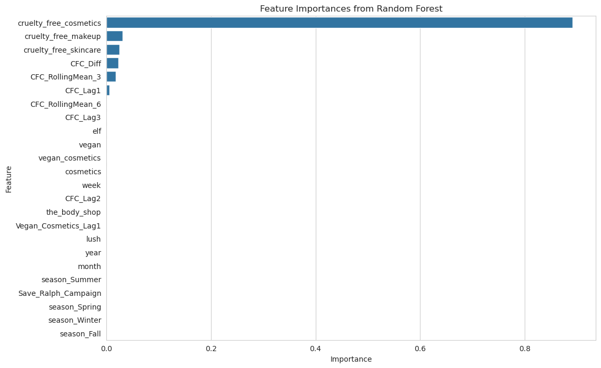


### **Explanation of Features and Their Importance**

1. **`cruelty_free_cosmetics` (0.891)**:
   - This feature has the highest importance score (0.891), meaning it plays a **significant role** in the model’s prediction. It is the most influential feature, explaining a large portion of the model's predictions.

2. **`cruelty_free_makeup` (0.031)**:
   - This feature is less important than `cruelty_free_cosmetics`, with an importance score of 0.031. It still provides some predictive value but is not as critical.

3. **`cruelty_free_skincare` (0.025)**:
   - This feature contributes to the model, but its impact is relatively small with an importance score of 0.025.

4. **`CFC_Diff` (0.023)**:
   - This feature represents the **difference** in `cruelty_free_cosmetics` values between consecutive periods. It has a small importance score (0.023), meaning the change in values from one period to the next has a minor influence on the model.

5. **`CFC_RollingMean_3` (0.018)**:
   - The **3-period rolling mean** of `cruelty_free_cosmetics` smooths the data over a short period of time. It has an importance score of 0.018, indicating that it is helpful for identifying trends, but its contribution is smaller compared to other features.

6. **`CFC_Lag1` (0.006)**:
   - This is the **lagged value** of `cruelty_free_cosmetics` from one period ago. With an importance score of 0.006, it suggests that past values influence the predictions, but to a much lesser degree than other features.

7. **`CFC_RollingMean_6` (0.001)**:
   - The **6-period rolling mean** of `cruelty_free_cosmetics` has the lowest importance score (0.001), meaning it has **minimal influence** on the model’s predictions.

### **Summary**
- The most important feature for the model is `cruelty_free_cosmetics`, explaining almost **90%** of the model's predictions.
- Other features like `cruelty_free_makeup` and `cruelty_free_skincare` contribute less but still provide useful context.
- Temporal features like `CFC_Diff`, `CFC_Lag1`, and the rolling means (`CFC_RollingMean_3`, `CFC_RollingMean_6`) have a smaller impact on the model’s predictions.

In simple terms, **`cruelty_free_cosmetics`** is the primary factor driving the model's predictions, while the remaining features provide additional context with lesser influence.

---

### 4.4. Preparing the Final Feature Set

The **Variance Inflation Factor (VIF)** is a measure used to detect multicollinearity in multiple regression models. 

If "Cruelty-Free Makeup" and "Cruelty-Free Skincare" have very similar trends (i.e., they tend to spike or drop at the same time), they may have high multicollinearity. Running a VIF check could help you identify that these variables are too closely related, and you might need to combine them or remove one to make the model more stable.

### **Interpreting VIF Values** 📏
 - VIF = 1: No correlation between the predictor variable and any other variables in the model.
 - VIF between 1 and 5: Indicates moderate correlation, but it's generally considered acceptable.
 - VIF > 5 or 10: Indicates high multicollinearity, which may cause problems. You should consider removing or combining these variables.

**Remove Features with High Multicollinearity (Infinite VIFs):**
  - **CFC_Diff**
  - **CFC_Lag1**
  - **CFC_Lag2**
  - **CFC_RollingMean_3**
  - **Cruelty_Free_Cosmetics** 

---

### 4.4. Final Feature Set Preparation
The final dataset should include only the most relevant features. After removing highly correlated and redundant features, we are left with the 

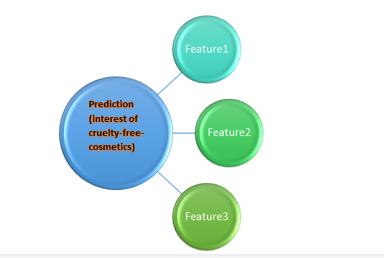

| **Feature**             | **VIF**       |
|-------------------------|---------------|
| **CFC_Lag3**            | 5.05          |
| **Save_Ralph_Campaign** | 1.46          |
| **Cruelty-Free Cosmetics** | 5.32       |
| **ELF**                 | 3.95          |
| **Week**                | 3.95          |

These features now form the core set for our predictive models, reducing the risk of overfitting and ensuring more accurate predictions. 📉

## 5. 💃 Model Building and Evaluation


### Goal: Train machine learning models, evaluate their performance, and pick the best one! 🎯

In this section, we're going to put our **data science skills** to the test by training a bunch of regression models. We’re aiming to predict **Cruelty-Free Cosmetics** based on keywords like vegan products, popular cosmetics brands, and more! 🌿💄

Let’s see how these models perform, and which one gives us the best predictions!

---

### 5.1 Model Selection 🎉

Since we’re predicting **how many** cruelty-free cosmetics people are searching for, we’ll use **regression models**. Regression models are perfect when we want to predict **continuous values** (like quantities or trends), not categories. 🌟

To evaluate how well our regression model is performing, we need to measure the difference between our predictions and the actual values. This is where metrics like MSE (Mean Squared Error), MAE (Mean Absolute Error), and R² (R-Squared) come in. 

Let’s take a look at these key metrics and how they help us understand our model's accuracy:
### MSE (Mean Squared Error) 🧮

| **MSE**        | **Meaning**                              |
|----------------|------------------------------------------|
| **Low MSE**    | Good predictions, closer to actual values |
| **High MSE**   | Predictions are far off                  |

### MAE (Mean Absolute Error) 📏

| **MAE**        | **Meaning**                              |
|----------------|------------------------------------------|
| **Low MAE**    | Better accuracy, closer to actual values |
| **High MAE**   | Predictions are off                      |

### R² (R-Squared) 📊

| **R² Value**   | **Meaning**                              |
|----------------|------------------------------------------|
| **R² = 1**     | Perfect model, explains 100% of data     |
| **R² = 0**     | Model explains nothing                   |
| **Negative R²**| Worse than predicting the average        |

---

**Summary**:
- **MSE** and **MAE** tell you how far off your predictions are.
- **R²** shows how well your model explains the data.

Now, let’s dive into the models we’re trying out to make these predictions. Each model will help us understand the relationship between various factors and search trends for cruelty-free cosmetics:

1. **Linear Regression**: A simple, classic model that predicts based on a straight-line relationship between features and target. 📈
2. **Decision Tree Regressor**: Think of it like a decision-making tree that splits the data into branches to make predictions. 🌳
3. **Random Forest Regressor**: A superpower combo of decision trees working together to improve accuracy! 🌲💪
4. **XGBoost (Default)**: This one’s a powerful boosting algorithm that fixes errors by building trees one after another. 🔥🌱
5. **Tuned Random Forest**: This is Random Forest, but **supercharged** with some fine-tuning to make it even better. ⚡
6. **XGBoost with Regularization** – A perfectionist with added robustness. 👌
7. **Fine-Tuned XGBoost** – A supercharged version of XGBoost built for dominance. 🚀

---

| **Model**                     | **MSE** | **MAE** | **R²**  |
|-------------------------------|---------|---------|---------|
| **Linear Regression**          | 0.04    | 0.18    | 0.29    |
| **Decision Tree**              | 0.01    | 0.06    | 0.78    |
| **Random Forest**              | 0.01    | 0.07    | 0.77    |
| **XGBoost (Default)**          | 0.01    | 0.06    | 0.78    |
| **Tuned Random Forest**        | 0.01    | 0.07    | 0.76    |
| **XGBoost (With Regularization)** | 0.02  | 0.09    | 0.69    |
| **Fine-Tuned XGBoost**         | 0.02    | 0.07    | 0.75    |

---

### 5.2 **XGBoost Breakdown**
#### 1. **XGBoost (Default)**
- **MSE:** 0.01  
- **MAE:** 0.06  
- **R²:** 0.78  
- **Why It Wins:** This model delivers a strong balance between accuracy and speed. It performs well on datasets of moderate complexity, making it a great choice without needing much fine-tuning. 

#### 2. **XGBoost with Regularization**
- **MSE:** 0.02  
- **MAE:** 0.09  
- **R²:** 0.69  
- **Why the Drop?**  While regularization helps prevent overfitting and improves generalization, it comes with a slight performance trade-off. The model's R² drops because the regularization sacrifices a bit of accuracy to avoid overfitting.

#### 3. **Fine-Tuned XGBoost**

- **Best Parameters:**  
  - Learning Rate: 0.1  
  - Max Depth: 3  
  - Estimators: 300  
  - Subsample: 0.8  
  - Colsample by Tree: 0.8  
  - L1 Regularization: 0.01  
  - L2 Regularization: 1  

- **Performance:**  
  - **MSE:** 0.02  
  - **MAE:** 0.07  
  - **R²:** 0.75  
- **Why It Shines:** The fine-tuned XGBoost model performs better than the regularized version and shows a good balance of performance and generalization. However, it doesn't surpass the default XGBoost in terms of accuracy (R²), but it still handles overfitting better and generalizes well.

---

### **5.3 Why Did XGBoost Perform the Best? 🌟**

Let’s talk about why **XGBoost (Default)** was the standout model 🌟 in our results:

- **XGBoost (Default)** performed the best among all the models, with an **R² of 0.78**. It strikes a strong balance between **accuracy** and **speed**, making it ideal for moderate complexity datasets. 🚀
  
- **XGBoost** uses a **boosting** technique, where each new tree improves on the mistakes of the previous one. This makes it highly effective at **sequentially improving** the model’s performance. It’s like **learning from mistakes** with every step! 🔄

#### **Why the Other Versions Didn't Perform Better**:

- **XGBoost with Regularization**:
    - **R²:** 0.69 (lower than default)
    - **Reason for Drop:** Regularization helps prevent **overfitting**, but in this case, it sacrificed some model accuracy. The **goal** was to improve **generalization**, but this came at the cost of model performance on the test data.
  
- **Fine-Tuned XGBoost**:
    - **R²:** 0.75
    - **Reason for Drop:** Hyperparameter tuning improved the model but didn’t match the **default XGBoost's** performance in terms of accuracy. While fine-tuning helped reduce overfitting and enhanced **generalization**, it wasn’t as accurate as the default model.

#### **Hyperparameter Tuning (GridSearchCV)**:

**GridSearchCV** was used to tune **XGBoost (Fine-Tuned)** and **Random Forest** models. The process tested **972 hyperparameter combinations** and used **5-fold cross-validation** to find the best parameters for the models.

- **GridSearchCV** helped us to find the **optimal settings** for the models by testing different combinations of hyperparameters, which significantly improved the model’s performance.

Here are the **final winning parameters** for **Fine-Tuned XGBoost**:

| **Hyperparameter**      | **Value**      |
|-------------------------|----------------|
| **Learning Rate**       | 0.1            |
| **Max Depth**           | 3              |
| **Number of Estimators**| 300            |
| **Subsample**           | 0.8            |
| **Colsample by Tree**   | 0.8            |
| **Reg Alpha (L1)**      | 0.01           |
| **Reg Lambda (L2)**     | 1              |


---


## 6. **Model Deployment and Dockerization** 🚀

This project provides insights into the future of ethical beauty, from collecting and preparing data to training models and deploying them using Flask and Docker. The use of containerization ensures that the application can be easily replicated and deployed in different environments without issues.


### **Project Structure** 🔧
The project is organized into clear directories and scripts for easier navigation and understanding. Here’s a breakdown of the project structure:

```
cruelty-free-cosmetics/
│
├── app.py                 # Flask application file 
├── train_model.py         # training ML models
├── environment.yml        # Conda environment file 
├── midproject.ipynb       # EDA and feature selection
├── cruelty-free-data/     # containing the dataset 
│   └── merged_data.csv    # Merged dataset 
├── models/                # trained model files 
│   └── ....pkl            # Pickled model file 
├── Dockerfile             # containerization
└── README.md              # project instructions
```

### **Dependency and Environment Management** 📝

#### **Prerequisites**:
Before you begin, ensure that you have the following tools installed on your system:

- **[Docker](https://www.docker.com/get-started)**: Docker is essential for containerizing the application, ensuring it runs consistently across different environments. Make sure Docker is installed and running on your machine. Follow the official guide to install it if you haven't already.
- **[Conda](https://docs.conda.io/projects/conda/en/latest/user-guide/install/index.html)** Conda is a powerful tool for managing environments and dependencies. If you're working in a Conda environment, make sure you have it installed locally. This is recommended for managing your project's dependencies.

#### **Step 1: Install Conda**
To manage environments and dependencies, you’ll need **Miniconda** (a lightweight version of Anaconda) or **Anaconda** (full distribution).

- **[Miniconda](https://docs.conda.io/en/latest/miniconda.html)**: Miniconda is a minimal installer for Conda. It's ideal if you want to create and manage environments without the extra packages provided by Anaconda.
- **[Anaconda](https://www.anaconda.com/products/distribution)**: If you prefer an all-in-one solution, Anaconda comes with a wide array of pre-installed packages, but it takes up more disk space.

Additionally, you’ll need **Git** to clone the repository to your local machine.


After installation, verify Conda was successfully installed by running:
```bash
conda --version
```

### Step 2: Clone the Project

Clone the project repository from GitHub:

```bash
git clone https://github.com/nevinpolat/cruelty-free-cosmetics.git
cd cruelty-free-cosmetics
```

### Step 3: Create the Conda Environment

In the project directory, you'll find the `environment.yml` file, which lists all the dependencies required to run the project. Create the Conda environment by running:

```bash
conda env create -f environment.yml
```

This command will set up a Conda environment named `cruelty-free-cosmetics` and install all the required dependencies.

### Step 4: Activate the Environment

Once the environment is created, activate it with the following command:

```bash
conda activate cruelty-free-cosmetics
```

You should now be inside the Conda environment, where all necessary dependencies are installed and available.

### **Exporting the Notebook to Script** 🧑‍💻
For better reproducibility and scalability, the **Jupyter notebook** (`midproject.ipynb`) has been exported to a script (`train_model.py`). This allows for easier execution of the model training without relying on the notebook interface.

- To export the notebook to a script:
  - Open the notebook and select **File > Download as > Python (.py)** in Jupyter.

### **Reproducibility** 🔄
The project is designed to be fully reproducible. Both the **Jupyter notebook** (`midproject.ipynb`) and the **training script** (`train_model.py`) can be re-executed without errors. The dataset is committed in the repository, and instructions for downloading it are included.

- **Dataset**: The dataset used for training is located in the [`cruelty-free-data/`](/cruelty_free_data/merged_data.csv) folder.


## **Model Deployment with Flask** 🚀

The trained model is deployed using **Flask**, allowing for real-time predictions via an API.

### **1. Steps to Run the Flask App**:
1. Start the Flask application by running:
   ```bash
   python app.py
   ```

2. Open a web browser and access the app at `http://127.0.0.1:5000/`.

### **2. How the Flask App Works**:
- The `app.py` file contains the web server that loads the trained model and exposes a `/predict` endpoint.
- Users can interact with the model by sending data to this endpoint and receiving predictions.

#### **Example cURL Request to Get Predictions**:
In a separate terminal, you can use the `curl` command to send a **POST** request to the Flask API:

```bash
curl -X POST http://127.0.0.1:5000/predict      -H "Content-Type: application/json"      -d '{
           "model_name": "random_forest_model",
           "input": {
               "CFC_Lag3": 24.0,
               "Save_Ralph_Campaign": 0,
               "cruelty_free_cosmetics": 27,
               "elf": 13,
               "week": 50
           }
         }'
```

The response will contain the prediction:

```json
{
  "prediction": [
    3.325238673416674
  ]
}
```

#### **Screenshots of the Flask App**:
- Flask app running: 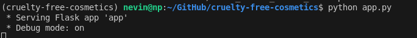
- Prediction response: 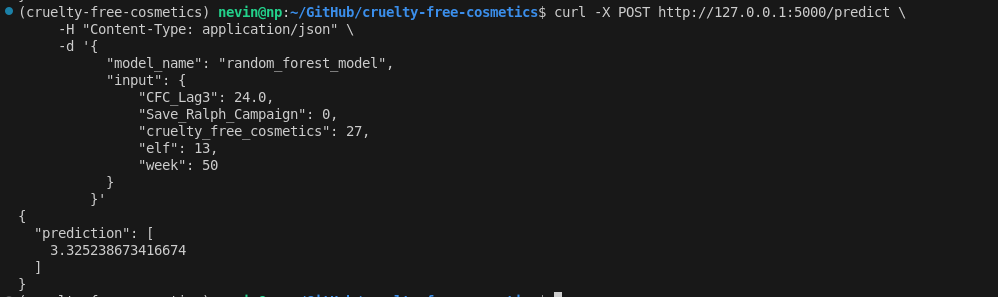

### **3. Closing the Flask App**:
To stop the Flask app:
- Press **Ctrl+Z** to suspend the app.
- Check which processes are using port 5000:
  ```bash
  lsof -i :5000
  ```

- Kill the process with the `PID` returned from the previous command:
  ```bash
  kill -9 <PID>
  ```


### **Containerization with Docker** 🐳

The entire application has been containerized using **Docker**. Docker ensures that the application runs the same way in any environment, making deployment easier and more consistent.

### **1. Build the Docker Image**:
To build the Docker image, run:
```bash
docker build -t nevin/cruelty-free-cosmetics:latest .
```

#### **Screenshot of Docker build**:
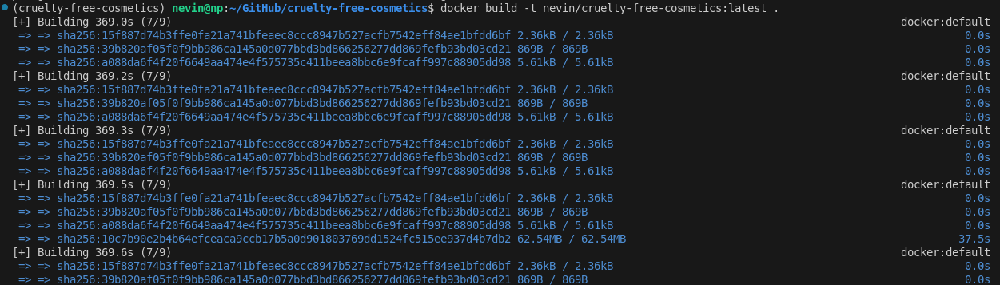

### **2. Run the Docker Container**:
Once the image is built, you can run the container using:
```bash
docker run -d -p 5000:5000 --name cruelty-free-cosmetics-container nevin/cruelty-free-cosmetics:latest
```

### **3. Access the App**:
The app will be accessible in your browser at `http://127.0.0.1:5000/`.

You can also test the API via terminal using the following `curl` command:

#### **Get Feature Names**:
```bash
curl http://127.0.0.1:5000/features
```

The response will be:
```json
{
  "feature_names": ["CFC_Lag3", "Save_Ralph_Campaign", "cruelty_free_cosmetics", "elf", "week"]
}
```

#### **Get Model Prediction**:
To make a prediction with the Random Forest model:
```bash
curl -X POST http://127.0.0.1:5000/predict      -H "Content-Type: application/json"      -d '{
           "model_name": "random_forest_model",
           "input": {
               "CFC_Lag3": 24.0,
               "Save_Ralph_Campaign": 0,
               "cruelty_free_cosmetics": 27,
               "elf": 13,
               "week": 50
           }
         }'
```

#### **Prediction Output**:
```json
{
  "prediction": [
    3.325238673416674
  ]
}
```

#### **Screenshot of the Dockerized Flask app**:
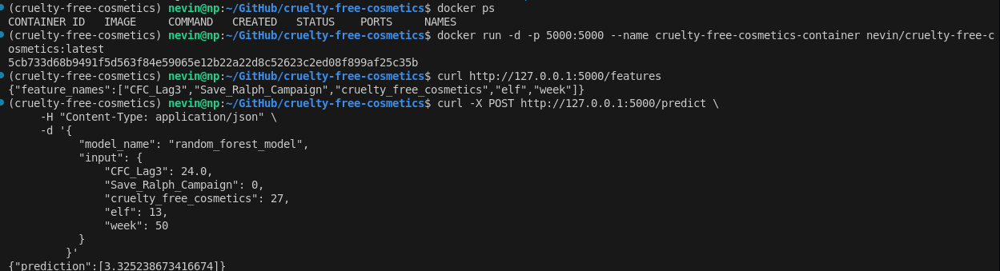


---


## 7. 🎉 **Conclusion and Recommendations** 🌟

### **What we learned?** 🔑
- **Top Performers:** XGBoost (Default) and Decision Tree strike an ideal balance between accuracy and interpretability. 📊
- **Model Optimization:** Fine-tuned XGBoost outperforms the default in generalization but sacrifices a bit of R². ⚙️
- **Viral Trends:** Ethical branding, like the "Save Ralph" campaign, can drive massive spikes in consumer interest, evident from the rise in cruelty-free searches in 2021. 📈
- **Ethical Beauty Movement:** Ethical beauty is more than a trend; it's a growing movement. By combining analytics with activism, we can drive meaningful change. 🐰💄✨

### 💡 **What's Next?** 🚀
- **Feature Enhancement:** Integrating social media sentiment to capture a wider view of consumer trends. 🌍
- **Strategic Timing:** Use the insights to fine-tune marketing campaigns during periods of heightened interest. ⏰
- **Dynamic Campaigns:** Target key moments to optimize marketing efforts for maximum impact. 📅

### **Practical Applications** 🛠️
1. **Marketing Strategy:** 📣
   - Identify **optimal times** for campaigns and product launches. ⏱️
   - Leverage competitor insights (e.g., "E.L.F. Cosmetics") to refine positioning. 💼

2. **Product Development:** 🧴
   - Align product offerings with growing consumer demand for cruelty-free and vegan products. 🌱

3. **Advocacy & Awareness:** 🌍
   - Ethical organizations can leverage these insights to measure **campaign impact** and optimize future strategies. 📊


### 💡 **Final Thoughts**
Despite facing challenges with limited data, this project serves a greater purpose. The insights into ethical beauty and animal rights awareness are vital, even if the data doesn’t fully reflect the trends we hoped for.

**Save Ralph** showed us how viral ethical branding can spark significant interest, even if the momentum fades over time. The interest in cruelty-free products peaked when the campaign was released, but sadly, that awareness has been waning. This is a reminder that more people need to care about the issue, and that's the real value of this project—raising awareness about animal cruelty and advocating for cruelty-free products.


### 📽️ **Watch the Save Ralph Campaign:**
---
Ethical beauty isn’t just a trend—it’s a movement, and **Save Ralph** is a perfect example. Here are some links to explore more about the campaign:

- **Official Save Ralph Website:** [Save Ralph Movie](https://www.hsi.org/saveralphmovie/)
- **Watch the Video on YouTube:** [Save Ralph - YouTube](https://www.youtube.com/watch?v=G393z8s8nFY&t=3s)
- **IMDb Listing:** [Save Ralph - IMDb](https://www.imdb.com/title/tt14220316/)
- **Wikipedia Article:** [Save Ralph - Wikipedia](https://en.wikipedia.org/wiki/Save_Ralph)
