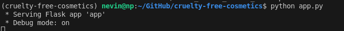

create conda environment
1-for eda and plots run midproject.ipynb

Training set size: 205 rows
Test set size: 52 rows
Data splitting completed. Training and testing datasets saved to files.

2- train_model.py 

Fitting 5 folds for each of 972 candidates, totalling 4860 fits
Final Model Performance Comparison:
                 Model   MSE   MAE  R_squared
0    Linear Regression  0.04  0.18       0.29
1        Decision Tree  0.01  0.06       0.78
2        Random Forest  0.01  0.07       0.77
3              XGBoost  0.01  0.06       0.78
4  Tuned Random Forest  0.01  0.07       0.76
5        Tuned XGBoost  0.01  0.07       0.77
Tuned Random Forest model saved as 'models/tuned_random_forest_model.pkl'

3- app.py for flask 

in another terminal 
(cruelty-free-cosmetics) nevin@np:~/GitHub/cruelty-free-cosmetics$ curl -X POST http://127.0.0.1:5000/predict \
     -H "Content-Type: application/json" \
     -d '{
           "model_name": "random_forest_model",
           "input": {
               "CFC_Lag3": 24.0,
               "Save_Ralph_Campaign": 0,
               "cruelty_free_cosmetics": 27,
               "elf": 13,
               "week": 50
           }
         }'
{
  "prediction": [
    3.325238673416674
  ]
}

ctrl+z close the app. 
check the port 5000
lsof -i :5000
kill -9 PID
4- docker image
Docker Installed: Ensure Docker is installed and running on your machine. Install Docker if you haven't already.

### **Prerequisites**

- [Docker](https://www.docker.com/get-started) installed on your machine.
- [Conda](https://docs.conda.io/projects/conda/en/latest/user-guide/install/index.html) installed locally (optional, for development).

Make sure [Docker](https://www.docker.com/get-started) installed on your machine.
docker build -t nevin/cruelty-free-cosmetics:latest .

docker run -d -p 5000:5000 --name cruelty-free-cosmetics-container nevin/cruelty-free-cosmetics:latest
(cruelty-free-cosmetics) nevin@np:~/GitHub/cruelty-free-cosmetics$ curl http://127.0.0.1:5000/features
{"feature_names":["CFC_Lag3","Save_Ralph_Campaign","cruelty_free_cosmetics","elf","week"]}
(cruelty-free-cosmetics) nevin@np:~/GitHub/cruelty-free-cosmetics$ curl -X POST http://127.0.0.1:5000/predict \
     -H "Content-Type: application/json" \
     -d '{
           "model_name": "random_forest_model",
           "input": {
               "CFC_Lag3": 24.0,
               "Save_Ralph_Campaign": 0,
               "cruelty_free_cosmetics": 27,
               "elf": 13,
               "week": 50
           }
         }'
{"prediction":[3.325238673416674]}

